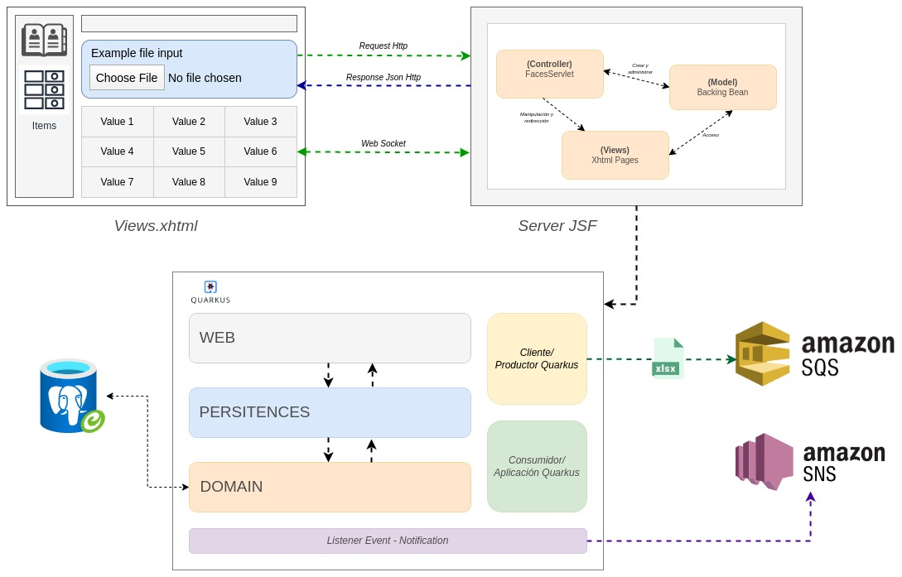

# Proyecto de notas estudiantil

#### Frontend.note.app

#### Pasos para crear proyecto JSF desde cero

Paro poder crear el proyecto JSF, la estructura de carpetas debe estar compuestas de la siguiente forma:

> **_NOTE:_** Tener encuenta que este es solo la estructura base, Si usted conoce otra forma, etaria genial pero recuerde colocar las configuraciones adecuadas para que no salten errores al momento de testear.

```
.── frontend.note.app
    ├── compile.docker.sh
    ├── diagram.jpg
    ├── dockerfile
    ├── hot.reload.docker.sh
    ├── index.sh
    ├── pom.xml
    ├── README.md
    ├── src
    │   ├── main
    │   │   ├── java
    │   │   │   └── com
    │   │   │       └── note
    │   │   │           ├── ApiHttp.java
    │   │   │           ├── bakingBeans
    │   │   │           │   ├── dashboard
    │   │   │           │   │   ├── FileUploadBean.java
    │   │   │           │   │   └── FormDataBean.java
    │   │   │           │   ├── leftPanel
    │   │   │           │   │   └── LeftPanelBeans.java
    │   │   │           │   ├── WebSocketClientBean.java
    │   │   │           │   └── WebSocketClient.java
    │   │   │           ├── dto
    │   │   │           │   ├── cluster
    │   │   │           │   │   ├── Group.java
    │   │   │           │   │   └── ResponseClusterDto.java
    │   │   │           │   ├── FormDto.java
    │   │   │           │   ├── RequestUploadDto.java
    │   │   │           │   ├── ResponseDto.java
    │   │   │           │   ├── teacher
    │   │   │           │   │   ├── RequestTeacherDto.java
    │   │   │           │   │   └── Subject.java
    │   │   │           │   └── TeacherOrClusterDto.java
    │   │   │           ├── IndexBean.java
    │   │   │           ├── services
    │   │   │           │   ├── FileServices.java
    │   │   │           │   ├── impl
    │   │   │           │   │   ├── FileImpl.java
    │   │   │           │   │   └── TeacherImpl.java
    │   │   │           │   └── TeacherServices.java
    │   │   │           ├── Singleton
    │   │   │           │   └── SocketSingleton.java
    │   │   │           └── util
    │   │   │               ├── ConvertDtoToJson.java
    │   │   │               └── FacesMessageUtil.java
    │   │   ├── resources
    │   │   │   └── META-INF
    │   │   │       └── beans.xml
    │   │   └── webapp
    │   │       ├── index.xhtml
    │   │       ├── resources
    │   │       │   ├── css
    │   │       │   │   ├── bootstrap.min.css
    │   │       │   │   ├── index.css
    │   │       │   │   └── primeflex.css
    │   │       │   ├── img
    │   │       │   │   └── imgNote-removebg-preview.png
    │   │       │   └── templates
    │   │       │       ├── ContentPage.xhtml
    │   │       │       ├── FileUpload.xhtml
    │   │       │       └── LeftPanel.xhtml
    │   │       └── WEB-INF
    │   │           └── web.xml
    │   └── test
    │       └── java
```

## 

#### Paso N° 1

Agregar las siguientes configuraciones en el `POM.xml`

> **_Configuración al inicio del archivo_**

```xml
    <groupId>com.note</groupId>
    <artifactId>frontend.note.app</artifactId>
    <name>frontend.note.app</name> <!-- Recuerde colocar el nombre que usted desee -->
    <version>1.0</version> <!-- Recuerde colocar la versión que usted desee -->
    <packaging>war</packaging>
```

> **_Configuración de las propiedades del archivo POM.xml_**
```xml
    <properties>
        <maven.compiler.source>11</maven.compiler.source>
        <maven.compiler.target>11</maven.compiler.target>
    </properties>
```
> **_Dependencias que necesitamos para poder contruir el proyecto JSF:_**

```xml
    <dependencies>
        <dependency>
            <groupId>jakarta.platform</groupId>
            <artifactId>jakarta.jakartaee-api</artifactId>
            <version>9.1.0</version>
            <scope>provided</scope>
        </dependency>
        <dependency>
            <groupId>jakarta.faces</groupId>
            <artifactId>jakarta.faces-api</artifactId>
            <version>3.0.0</version>
            <scope>provided</scope>
        </dependency>
        <dependency>
            <groupId>org.primefaces</groupId>
            <artifactId>primefaces</artifactId>
            <version>10.0.0</version>
            <classifier>jakarta</classifier>
        </dependency>
        <dependency>
            <groupId>jakarta.enterprise</groupId>
            <artifactId>jakarta.enterprise.cdi-api</artifactId>
            <version>3.0.0</version>
            <scope>provided</scope>
        </dependency>
        <dependency>
            <groupId>org.projectlombok</groupId>
            <artifactId>lombok</artifactId>
            <version>1.18.20</version>
            <scope>provided</scope>
        </dependency>
    </dependencies>
```

> **_Configuración para poder contruir el empaquetado del aplicativo:_**
```xml
    <build>
        <finalName>appweb</finalName>
        <plugins>
            <plugin>
                <groupId>org.apache.maven.plugins</groupId>
                <artifactId>maven-war-plugin</artifactId>
                <version>3.3.1</version>
            </plugin>
        </plugins>
    </build>
```

### Paso N° 2
Crea un archivo ```web.xml``` en la carpeta ```webapp/WEB-INF``` de tu aplicación JSF. El archivo web.xml actúa como un descriptor de implementación que proporciona las configuraciones de despliegue.

#### Configuración
Para desplegar esta aplicación, sigue los siguientes pasos:
```xml
<?xml version="1.0" encoding="UTF-8"?>
<web-app xmlns="https://jakarta.ee/xml/ns/jakartaee"
         xmlns:xsi="http://www.w3.org/2001/XMLSchema-instance"
         xsi:schemaLocation="https://jakarta.ee/xml/ns/jakartaee https://jakarta.ee/xml/ns/jakartaee/web-app_5_0.xsd"
         version="5.0">

    <servlet>
        <servlet-name>Faces Servlet</servlet-name>
        <servlet-class>jakarta.faces.webapp.FacesServlet</servlet-class>
        <load-on-startup>1</load-on-startup>
    </servlet>

    <session-config>
        <session-timeout>
            30
        </session-timeout>
    </session-config>

    <servlet-mapping>
        <servlet-name>Faces Servlet</servlet-name>
        <url-pattern>*.xhtml</url-pattern>
    </servlet-mapping>

    <welcome-file-list>
        <welcome-file>index.xhtml</welcome-file>
    </welcome-file-list>

</web-app>
```

### Paso N° 3
El siguiente código es una clase Java que parece ser un bean de respaldo (backing bean) para una página web JavaServer Faces (JSF).
```java
import jakarta.annotation.PostConstruct;
import jakarta.faces.view.ViewScoped;
import jakarta.inject.Named;
import lombok.Getter;
import lombok.Setter;

import java.io.Serializable;

@Named(value = "index_bean")
@ViewScoped
@Getter
@Setter
public class IndexBean implements Serializable {

    private String informacion;

    @PostConstruct
    public void init() {
        this.informacion = "Lo ha logrado!!";
    }
}
```

### Paso N° 4
Ahora como ultimo paso creamos una vista en index.xhtml para poder tener acceso a la variable informacion que se encuentra en el backingBean:

```htlm
<!DOCTYPE html PUBLIC "-//W3C//DTD XHTML 1.0 Transitional//EN"
        "http://www.w3.org/TR/xhtml1/DTD/xhtml1-transitional.dtd">
<html xmlns="http://www.w3.org/1999/xhtml"
      xmlns:h="http://java.sun.com/jsf/html"
      xmlns:p="http://primefaces.org/ui">
<h:head>
</h:head>
<body>
    <p:outputLabel value="Bienvenido a us app JSF : #{index_bean.informacion}" />
</body>
</html>
```

## Configuración adicional 
dentro la carpeta resources de primer nivel, es decir, Donde no estan ubicados los css y js, crear una carpeta META-INF (```resources/META-INF```) y crear el siguiente archivo ```beans.xml``` y colocar el siguiente código :
```xml
<beans xmlns="https://jakarta.ee/xml/ns/jakartaee"
    xmlns:xsi="http://www.w3.org/2001/XMLSchema-instance"
    xsi:schemaLocation="https://jakarta.ee/xml/ns/jakartaee https://jakarta.ee/xml/ns/jakartaee/beans_3_0.xsd"
    bean-discovery-mode="all">
</beans>
``` 


## Configuración de DockerFile
En este ejemplo no vamos a descargar un servidor de aplicaciones, Usaremos un dockerfile para descargar la imagen de widfly y lo subiremos para ver y escalar nuestra aplicación.


### Creacion de dockerfile
```docker
# De forma predeterminada, compila en JDK 17 en CentOS 7.
ARG jdk=21
# Red Hat UBI 9 (ubi9-minimal) debe usarse en JDK 20 y versiones posteriores.
ARG dist=ubi9-minimal
FROM eclipse-temurin:${jdk}-${dist}

LABEL org.opencontainers.image.source=https://github.com/jboss-dockerfiles/wildfly org.opencontainers.image.title=wildfly org.opencontainers.imag.url=https://github.com/jboss-dockerfiles/wildfly org.opencontainers.image.vendor=WildFly

# A partir de jdk 21 eclipse-temurin se basa en ubi9-minimal versión 9.3
# que no incluye el paquete shadow-utils que proporciona comandos groupadd y useradd
# EJECUCIÓN condicional: SI no hay groupadd Y microdnf ENTONCES: actualice, instale Shadow-Utils, limpie
RUN if ! [ -x "$(command -v groupadd)" ] && [ -x "$(command -v microdnf)" ]; then microdnf update -y && microdnf install --best --nodocs -y shadow-utils && microdnf clean all; fi

WORKDIR /opt/jboss

RUN groupadd -r jboss -g 1000 && useradd -u 1000 -r -g jboss -m -d /opt/jboss -s /sbin/nologin -c "JBoss user" jboss && \
    chmod 755 /opt/jboss

# Establecer la variable de entorno WILDFLY_VERSION
ENV WILDFLY_VERSION 32.0.0.Final
ENV WILDFLY_SHA1 9b6d762aa4662045fc3e7329a1ed1c0d457daf6d
ENV JBOSS_HOME /opt/jboss/wildfly

USER root

# Agregue la distribución WildFly a /opt y haga que Wildfly sea el propietario del contenido de alquitrán extraído.
# Asegúrese de que la distribución esté disponible en un lugar conocido
RUN cd $HOME \
    && curl -L -O https://github.com/wildfly/wildfly/releases/download/$WILDFLY_VERSION/wildfly-$WILDFLY_VERSION.tar.gz \
    && sha1sum wildfly-$WILDFLY_VERSION.tar.gz | grep $WILDFLY_SHA1 \
    && tar xf wildfly-$WILDFLY_VERSION.tar.gz \
    && mv $HOME/wildfly-$WILDFLY_VERSION $JBOSS_HOME \
    && rm wildfly-$WILDFLY_VERSION.tar.gz \
    && chown -R jboss:0 ${JBOSS_HOME} \
    && chmod -R g+rw ${JBOSS_HOME}


# Copia tu archivo WAR de la aplicación al directorio de implementación de WildFly
COPY ./target/appweb.war /opt/jboss/wildfly/standalone/deployments/

# Ensure signals are forwarded to the JVM process correctly for graceful shutdown
ENV LAUNCH_JBOSS_IN_BACKGROUND true

USER jboss

# Exponer los puertos en los que estamos interesados
EXPOSE 8080

CMD ["/opt/jboss/wildfly/bin/standalone.sh", "-b", "0.0.0.0"]
```

Para construir la imagen Docker, puedes ejecutar el siguiente comando en el mismo directorio que el Dockerfile:


```docker
docker build -t nombre_de_tu_imagen .
```

Y luego, para ejecutar un contenedor basado en esta imagen:
```docker
docker run -p 8080:8080 --name nombre_de_tu_imagen_container  nombre_de_tu_imagen
```

Esto iniciará un contenedor Docker con tu aplicación JSF desplegada en WildFly, y podrás acceder a ella a través del puerto 8080 de tu máquina host.
```
http://localhost:8080/appweb/index.xhtml
```

#### Desarrollo Local
En caso de querer trabajar con un servidor de aplicaciones puede usar un IDE:
- Netbeans.
- IntelliJ IDEA.
- Eclipse.
- Usar Visual Studio Code.

En caso de usar Visual Studio Code, debe tener instalado su servidor de aplicacion, en este caso se usa WidFly, Puede tener el siguiente ```sh```para poder hacer cambios y desplegar:
```sh
#!/bin/bash

rm -r target/
mvn clean install compile package
rm -r /opt/wildfly-32.0.0.Final/standalone/deployments/*
mv target/appweb.war /opt/wildfly-32.0.0.Final/standalone/deployments/
/opt/wildfly-32.0.0.Final/bin/standalone.sh 
```


